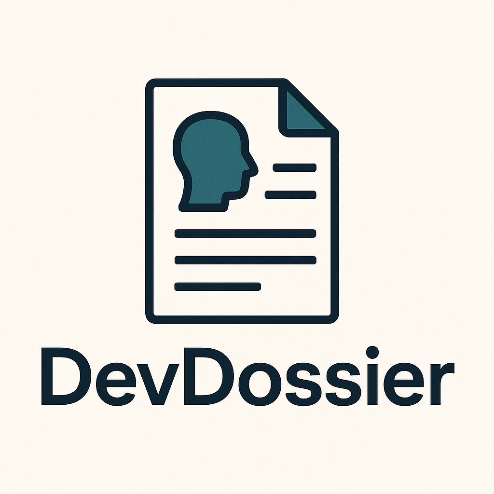

<div align="center">
  
</div>

# DevDossier

**AI-Powered Developer Resume Builder**

Transform your GitHub profile into a professional resume with AI-powered expertise. DevDossier analyzes your repositories, extracts technical skills, and crafts compelling professional narratives that showcase your development achievements.

## Features

✨ **AI Resume Expert** - Professional resume writer with 10+ years experience  
🔍 **Smart GitHub Analysis** - Automatically analyzes repositories and code quality  
📊 **Impact-Driven Writing** - Transforms code into compelling achievements  
🎯 **ATS Optimization** - Ensures resumes pass Applicant Tracking Systems  
🎨 **Professional Templates** - Choose from Classic, Modern, and Minimal designs  
🎨 **Theme Customization** - Customize colors to match your personal brand  
📝 **In-App Resume Editor** - Edit and preview resumes without opening new windows  
📄 **PDF Export** - Download professional PDFs with one click  
🤖 **Smart Repository Selection** - AI automatically selects most relevant projects for job descriptions  
🔄 **Real-Time Preview** - See changes instantly as you customize your resume  

## Tech Stack

- **Next.js 15** with App Router and Turbopack
- **TypeScript** for type safety
- **Tailwind CSS** with custom black/white/orange theme
- **Shadcn/ui** for polished components
- **Jest & React Testing Library** for comprehensive testing
- **GitHub OAuth** for secure authentication

## Getting Started

1. **Install dependencies:**
   ```bash
   npm install
   ```

2. **Set up environment variables:**
   ```bash
   cp .env.example .env.local
   # Add your GitHub OAuth credentials
   ```

3. **Run the development server:**
   ```bash
   npm run dev
   ```

4. **Open [http://localhost:3000](http://localhost:3000)** in your browser

## Development

```bash
# Run tests
npm test

# Run tests in watch mode
npm run test:watch

# Lint code
npm run lint

# Build for production
npm run build
```

## Resume Builder Features

### 🎨 **Template Selection**
- **Classic**: Traditional professional layout with clean typography
- **Modern**: Contemporary design with sidebar and visual elements  
- **Minimal**: Clean, ATS-friendly format optimized for applicant tracking systems

### 🎯 **Smart Job Targeting**
- Paste any job description to get AI-powered repository recommendations
- Automatically selects repositories with high relevance scores
- Tailors resume content to match specific job requirements
- Confidence scoring for each repository match

### 📝 **Resume Customization**
- Real-time preview with instant template switching
- Color theme customization with professional presets
- Structured data generation for consistent formatting
- Export to PDF with print-optimized layouts

### 🤖 **AI-Powered Content**
- Professional summary generation tailored to your experience
- Achievement-focused project descriptions with quantifiable impact
- Technical skills extraction and categorization
- ATS keyword optimization for better application screening

## Architecture

Built with **Test-Driven Development (TDD)** ensuring robust, maintainable code:

- **Components:** Fully tested React components with TypeScript
- **Services:** GitHub API integration with proper error handling
- **AI Integration:** OpenAI GPT-4 for intelligent resume generation
- **Resume Engine:** Template-based HTML generation with PDF export
- **Authentication:** Secure GitHub OAuth flow

## Contributing

This project follows TDD principles. Please ensure all new features include comprehensive tests.

---

*Built with ❤️ for developers who want to showcase their skills professionally*
